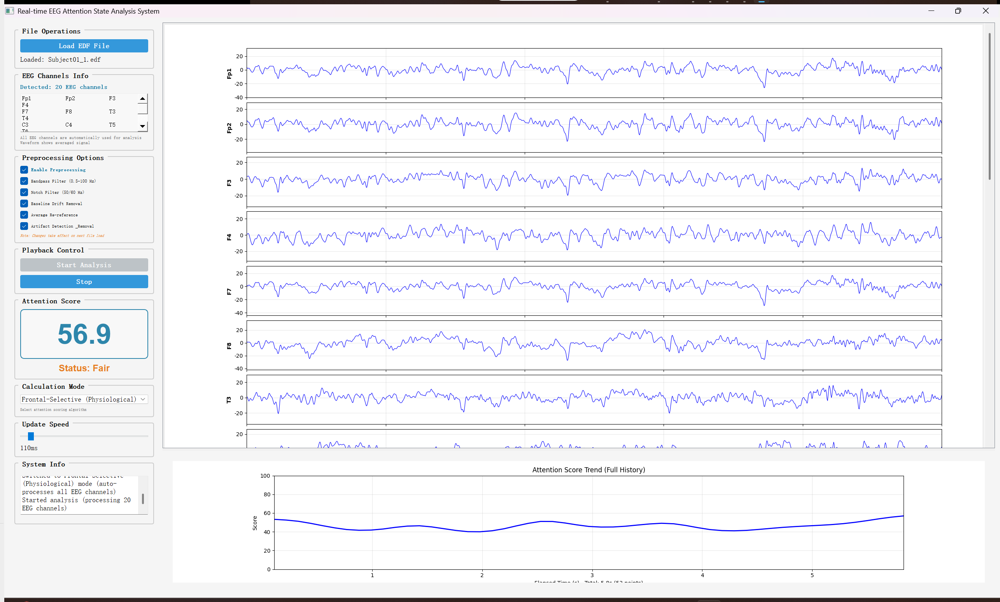

# Real-time EEG Attention State Analysis System
This is a simple demo to show how eeg refect our Attention State.

## Implemented Features

### Core Features
1. ✅ **EEG Signal Processing** - Professional EEG signal processing using MNE library and Welch's method for PSD
2. ✅ **EDF File Support** - Full support for loading and analyzing EDF format EEG files
3. ✅ **Frequency Band Analysis** - Real-time decomposition of Delta, Theta, Alpha, Beta, and Gamma bands
4. ✅ **Multiple Attention Scoring Modes** - 4 different calculation methods based on neuroscience research
5. ✅ **Real-time Mode Switching** - Switch between calculation modes on-the-fly in GUI
6. ✅ **Real-time Visualization** - Dynamic display of waveforms, frequency bands, and attention trends
7. ✅ **Comprehensive Preprocessing** - Configurable preprocessing pipeline with 4 processing steps
8. ✅ **Multi-channel Display** - Automatic display of all EEG channels with synchronized visualization

### Interface Features
1. ✅ **Professional GUI** - Modern user interface built with PyQt5 and Matplotlib
2. ✅ **All-Channel Waveform Display** - Simultaneous display of all EEG channels in a scrollable interface
3. ✅ **Flexible Signal Selection** - Users can freely choose which frequency bands to display via checkboxes
4. ✅ **Select All/Deselect All** - One-click control of all signal display states
5. ✅ **Color Coding** - Different signals use different colors for easy identification
6. ✅ **Attention Score Display** - Large font display of score and status description
7. ✅ **Calculation Mode Selector** - Dropdown menu to switch between 4 attention calculation methods in real-time
8. ✅ **Preprocessing Controls** - Granular control over preprocessing steps (baseline, re-reference, bandpass, notch)
9. ✅ **Trend Analysis Plot** - Historical attention score change trend with full history tracking
10. ✅ **Interactive Controls** - File loading, speed adjustment, playback controls
11. ✅ **Channel Information Panel** - Automatic detection and display of all EEG channels in the file

### System GUI


## Technical Architecture

### File Structure
```
eeg-focus/
├── simple_main.py             # Main program entry point
├── simple_main_window.py     # GUI interface (PyQt5 + Matplotlib)
├── eeg_processor.py           # EEG signal processing core module
├── requirements.txt           # Project dependency list
├── readme.md                  # Project documentation
├── debug_edf.py               # EDF file debugging utilities
├── visualize_detrend.py       # Visualization utilities
└── Subject01_1.edf           # Sample EDF file
```

### Core Technology Stack
- **Python 3.12** - Programming language
- **PyQt5** - GUI framework
- **MNE** - EEG data loading and handling
- **NumPy** - Numerical computation
- **SciPy** - Signal processing and filtering
- **Matplotlib** - Data visualization 

## Attention Scoring Algorithm Details

### Multiple Calculation Modes

The system supports **4 different attention scoring methods**, each with unique advantages:

#### 1. **Relative Power Method** (Default)
- Uses normalized frequency band power ratios
- Reduces individual differences
- Processes all EEG channels automatically
- Best for general-purpose monitoring

#### 2. **Logarithmic Power Method**
- Preserves absolute power information
- Uses log-transformed powers with sigmoid mapping
- Processes all EEG channels automatically
- Better for detecting arousal level changes

#### 3. **Beta/Theta Ratio Method**
- Classic neuroscience attention indicator
- Based on Beta/(Alpha+Theta) ratio
- Processes all EEG channels automatically
- Well-validated in research literature

#### 4. **Frontal-Selective Method** (Physiological)
- Based on selective attention physiology
- **Task-relevant regions (Frontal)**: Beta increase indicates focused cognitive processing
  - Channels: Fp1, Fp2, F3, F4, F7, F8, Fz
- **Task-irrelevant regions (Non-frontal)**: Alpha increase indicates selective inhibition
  - Channels: P3, P4, Pz, O1, O2, and additional parietal/central/temporal regions
- Combines: 70% frontal Beta z-score + 30% non-frontal Alpha z-score
- Uses z-score normalization for robust interpretation
- Best for understanding attention mechanisms
- **Uses all EEG channels for comprehensive analysis**


### Algorithm Principles
Based on the relationship between different EEG frequency bands and cognitive states in neuroscience research:

#### Frequency Band Weight Design (Used in Relative & Logarithmic Methods)
1. **Beta Waves (13-30Hz)** - Weight **+0.6**
   - Positively correlated with attention focus and alertness
   - High Beta activity indicates active cognitive state

2. **Alpha Waves (8-13Hz)** - Weight **-0.5**
   - Related to relaxation and rest state
   - Excessively high Alpha may indicate lack of attention

3. **Theta Waves (4-8Hz)** - Weight **-0.3**
   - Related to drowsiness and meditation state
   - High Theta activity indicates declining attention

4. **Delta Waves (0.5-4Hz)** - Weight **-0.1**
   - Related to deep sleep
   - Should be very low in waking state

5. **Gamma Waves (30-45Hz)** - Weight **+0.2**
   - Related to higher cognitive functions
   - Moderate levels beneficial for attention maintenance

### Signal Processing Pipeline

#### Preprocessing Steps (Configurable)
1. **Baseline Drift Removal** - Removes slow drifts and trends using linear detrending
2. **Average Re-referencing** - Re-references all channels to the average of all channels
3. **Bandpass Filtering** - 0.5-100 Hz Butterworth filter to remove out-of-band noise
4. **Notch Filtering** - Removes 50/60 Hz power line interference

#### Analysis Steps
1. **Frequency Band Decomposition** - Separate frequency bands using Butterworth filter
2. **Power Spectral Density** - Calculate PSD using Welch's method
3. **Band Power Integration** - Integrate PSD in frequency ranges for accurate power (μV²)
4. **Multi-channel Processing** - Automatically processes all EEG channels in the file
5. **Mode-specific Calculation** - Apply selected calculation method
6. **Score Mapping** - Display in 0-100 range with appropriate normalization

### Score Interpretation
- **80-100 points** - Highly focused state
- **60-79 points** - Good attention state
- **40-59 points** - Fair attention state
- **0-39 points** - Unfocused state


## Usage

### Quick Start

1. **Install dependencies** (if not already installed):
```bash
pip install -r requirements.txt
```

2. **Run the application**:
```bash
python simple_main.py
```

3. **Load an EDF file**:
   - Click "Load EDF File" button
   - Select your EEG data file (e.g., Subject01_1.edf)
   - The system will automatically detect all EEG channels

4. **Start Analysis**:
   - Click "Start Analysis" to begin real-time analysis
   - Adjust update speed as needed
   - Switch between different calculation modes to compare results

### Switching Attention Calculation Modes

In the GUI, find the **"Calculation Mode"** dropdown in the control panel:
1. Select from 4 available modes:
   - Relative Power (default)
   - Logarithmic Power
   - Beta/Theta Ratio
   - Frontal-Selective (Physiological)
2. The attention score updates immediately when you switch modes
3. Try different modes to see which works best for your data
4. **All modes automatically process all EEG channels** in the loaded file

### Configuring Preprocessing Options

In the **"Preprocessing Options"** panel:
1. **Enable/Disable Preprocessing** - Master switch for all preprocessing
2. **Baseline Drift Removal** - Remove slow baseline drifts
3. **Average Re-reference** - Apply average re-referencing
4. **Bandpass Filter** - Filter to 0.5-100 Hz range
5. **Notch Filter** - Remove 50/60 Hz power line interference

**Note**: Changes to preprocessing settings take effect when you load or reload the EDF file.

### Understanding the Display

1. **Channel List Panel**: Shows all detected EEG channels automatically
2. **Waveform Display**: 
   - Displays all channels in a scrollable view
   - Each channel can show original signal + frequency bands
   - Use checkboxes to select which frequency bands to display
3. **Attention Score**: Real-time score (0-100) with color-coded status
4. **Trend Plot**: Complete history of attention scores over time
5. **Speed Control**: Adjust update rate (50-1000ms) for playback speed
