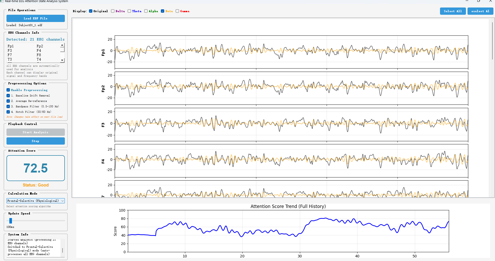

# Real-time EEG Attention State Analysis System
This is a simple demo to show how eeg refect our Attention State.

## Implemented Features

### Core Features
1. ✅ **EEG Signal Processing** - Professional EEG signal processing using MNE library and Welch's method for PSD
2. ✅ **Multi-source Signal Support** - Support for EDF file loading and simulated real-time signal generation
3. ✅ **Frequency Band Analysis** - Real-time decomposition of Delta, Theta, Alpha, Beta, and Gamma bands
4. ✅ **Multiple Attention Scoring Modes** - 5 different calculation methods based on neuroscience research
5. ✅ **Real-time Mode Switching** - Switch between calculation modes on-the-fly in GUI
6. ✅ **Real-time Visualization** - Dynamic display of waveforms, frequency bands, and attention trends

### Interface Features
1. ✅ **Professional GUI** - Modern user interface built with PyQt5
2. ✅ **Combined Waveform Display** - Original signal and frequency band signals displayed on the same plot for better visual effect
3. ✅ **Flexible Signal Selection** - Users can freely choose which signal waveforms to display via checkboxes
4. ✅ **Select All/Deselect All** - One-click control of all signal display states
5. ✅ **Color Coding** - Different signals use different colors for easy identification
6. ✅ **Attention Score Display** - Large font display of score and status description
7. ✅ **Calculation Mode Selector** - Dropdown menu to switch between 5 attention calculation methods in real-time
8. ✅ **Smart Electrode Management** - Automatic electrode selection/deselection based on calculation mode
9. ✅ **Trend Analysis Plot** - Historical attention score change trend
10. ✅ **Interactive Controls** - File loading, channel selection, speed adjustment, etc.



## Technical Architecture

### File Structure
```
eeg-focus/
├── simple_main.py             # Simplified version main program entry
├── simple_main_window.py      # Simplified version GUI interface (requires only matplotlib)
├── eeg_processor.py           # EEG signal processing core module
├── requirements.txt           # Project dependency list
├── README.md                  # Main project documentation
└── Subject01_1.edf           # Test EDF file
```

### Core Technology Stack
- **Python 3.12** 
- **PyQt5** 
- **MNE** 
- **NumPy** 
- **SciPy** 
- **Matplotlib** 

## Attention Scoring Algorithm Details

### 🆕 Multiple Calculation Modes

The system now supports **5 different attention scoring methods**, each with unique advantages:

#### 1. **Relative Power Method** (Default)
- Uses normalized frequency band power ratios
- Reduces individual differences
- Best for general-purpose monitoring

#### 2. **Logarithmic Power Method**
- Preserves absolute power information
- Uses log-transformed powers with sigmoid mapping
- Better for detecting arousal level changes

#### 3. **Beta/Theta Ratio Method**
- Classic neuroscience attention indicator
- Based on Beta/(Alpha+Theta) ratio
- Well-validated in research literature

#### 4. **Combined Method**
- Integrates all three approaches (40% relative, 30% log, 30% ratio)
- Most robust and reliable
- Recommended for most applications

#### 5. **Frontal-Selective Method** (Physiological) 🆕
- Based on selective attention physiology
- **Task-relevant regions (Frontal)**: Beta increase indicates focused cognitive processing
  - Channels: Fp1, Fp2, F3, F4, F7, F8, Fz
- **Task-irrelevant regions (Non-frontal)**: Alpha increase indicates selective inhibition
  - Channels: P3, P4, Pz, O1, O2
- Combines: 60% frontal Beta + 40% non-frontal Alpha
- Best for understanding attention mechanisms
- **Uses all EEG channels for comprehensive analysis**
- **🔧 Smart electrode selection**: Channel selection is automatically disabled when using this mode
  - Electrodes are pre-configured based on physiological regions
  - No manual channel selection needed
  - Automatically switches back to manual selection when switching to other modes


### Algorithm Principles
Based on the relationship between different EEG frequency bands and cognitive states in neuroscience research:

#### Frequency Band Weight Design
1. **Beta Waves (13-30Hz)** - Weight **+0.6**
   - Positively correlated with attention focus and alertness
   - High Beta activity indicates active cognitive state

2. **Alpha Waves (8-13Hz)** - Weight **-0.2**
   - Related to relaxation and rest state
   - Excessively high Alpha may indicate lack of attention

3. **Theta Waves (4-8Hz)** - Weight **-0.3**
   - Related to drowsiness and meditation state
   - High Theta activity indicates declining attention

4. **Delta Waves (0.5-4Hz)** - Weight **-0.1**
   - Related to deep sleep
   - Should be very low in waking state

5. **Gamma Waves (30-45Hz)** - Weight **+0.2**
   - Related to higher cognitive functions
   - Moderate levels beneficial for attention maintenance

### Improved Calculation Process
1. **Signal Preprocessing** - Remove noise with bandpass filtering
2. **Frequency Band Decomposition** - Separate frequency bands using Butterworth filter
3. **Power Spectral Density** - Calculate PSD using Welch's method (corrected from RMS)
4. **Band Power Integration** - Integrate PSD in frequency ranges for accurate power (μV²)
5. **Mode-specific Calculation** - Apply selected calculation method
6. **Score Mapping** - Display in 0-100 range with appropriate normalization

### Score Interpretation
- **80-100 points** - Highly focused state
- **60-79 points** - Good attention state
- **40-59 points** - Fair attention state
- **0-39 points** - Unfocused state


## Usage

### Quick Start

```bash
python simple_main.py
```

### Switching Attention Calculation Modes

In the GUI, find the **"Calculation Mode"** dropdown in the control panel:
1. Select from 5 available modes:
   - Relative Power (default)
   - Logarithmic Power
   - Beta/Theta Ratio
   - Combined Method
   - Frontal-Selective (Physiological) - NEW!
2. The attention score updates immediately when you switch modes
3. Try different modes to see which works best for your data
4. **Note for Frontal-Selective mode**:
   - The channel selection dropdown will be automatically disabled
   - Electrodes are pre-configured: frontal (Fp1, Fp2, F3, F4, F7, F8, Fz) and posterior (P3, P4, Pz, O1, O2)
   - This mode analyzes all EEG channels simultaneously for a comprehensive physiological assessment
   - When you switch back to other modes, channel selection will be re-enabled automatically
